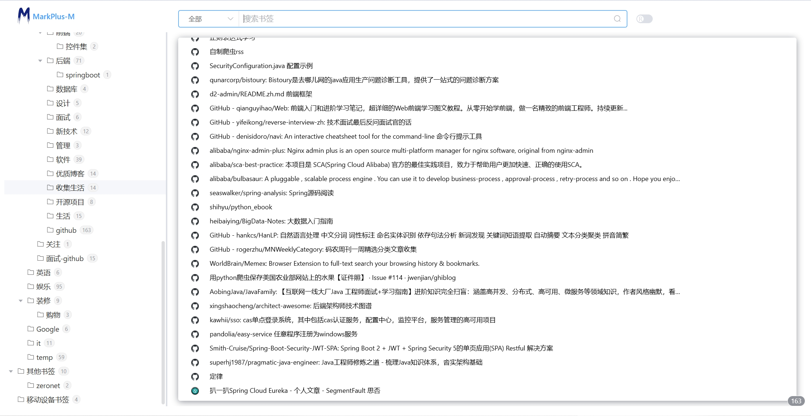
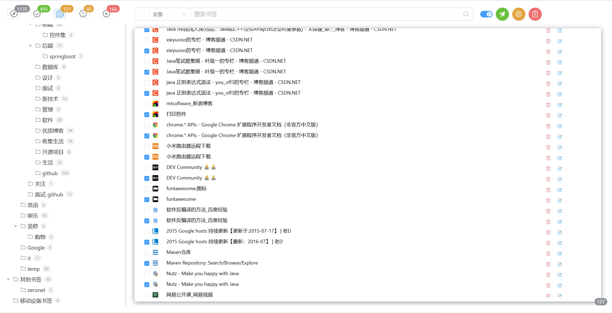

# MarkPlus-M 文档

Chrome 书签增强工具 - 让你的书签管理更智能

[//]: # ([English]&#40;./docs/en/README.md&#41; | 简体中文)

## 简介

增强浏览器的书签管理功能。集成Google AI Studio，自动为书签生成标签，帮助用户更好地组织和检索书签。

## 特性

- 🤖 AI 驱动的标签生成
- 📊 直观的数据统计
- 🔍 增强搜索功能
- 💾 本地数据存储
- 🛡️ 注重隐私保护

## 使用说明
> 书签管理中操作书签会同步操作chrome中书签，最好备份之后再操作

### 基本操作
1. 扩展搜索，搜索框左侧可下拉通过扩展信息搜索

2. 编辑模式下，通过chrome.tabs获取网页扩展数据，再次点击停止获取

> 获取数据过程中会不停的打开和关闭标签页，按需配置同时打开标签个数

3.编辑模式下，点击左上角统计内容批量删除书签

### 配置说明
> 总结网页标签需要Google AI Studio密钥，使用的模型是learnlm-1.5-pro-experimental，

# Changelog
## 0.0.3
### 修复
- 后台挂起导致页面按钮失效

### 新增
- 增加依据浏览器语言进行默认国际化
