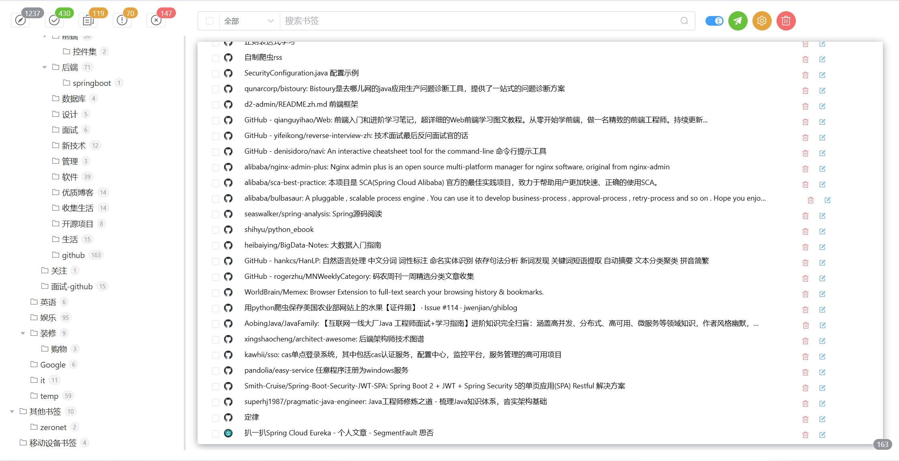
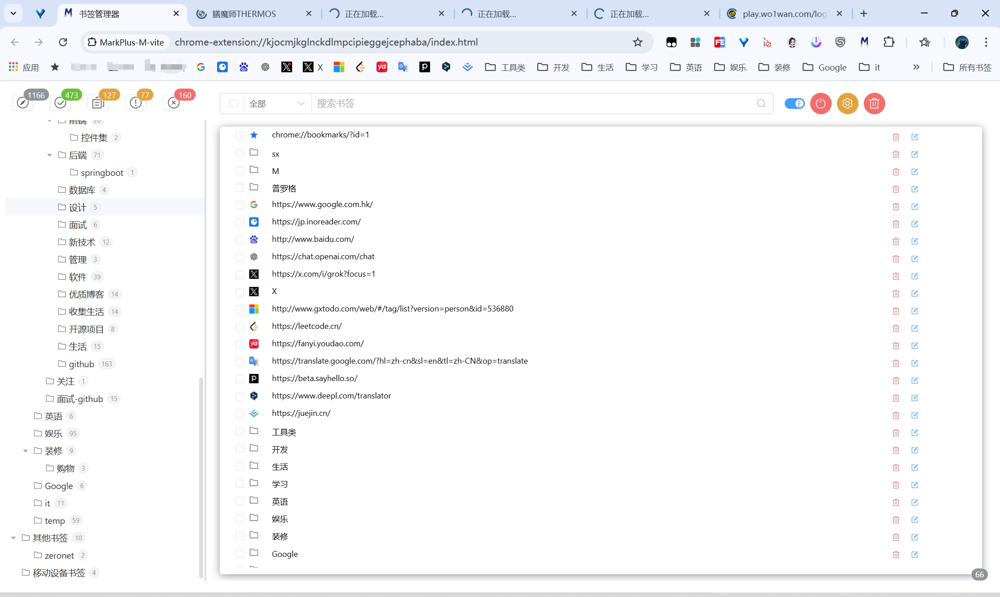
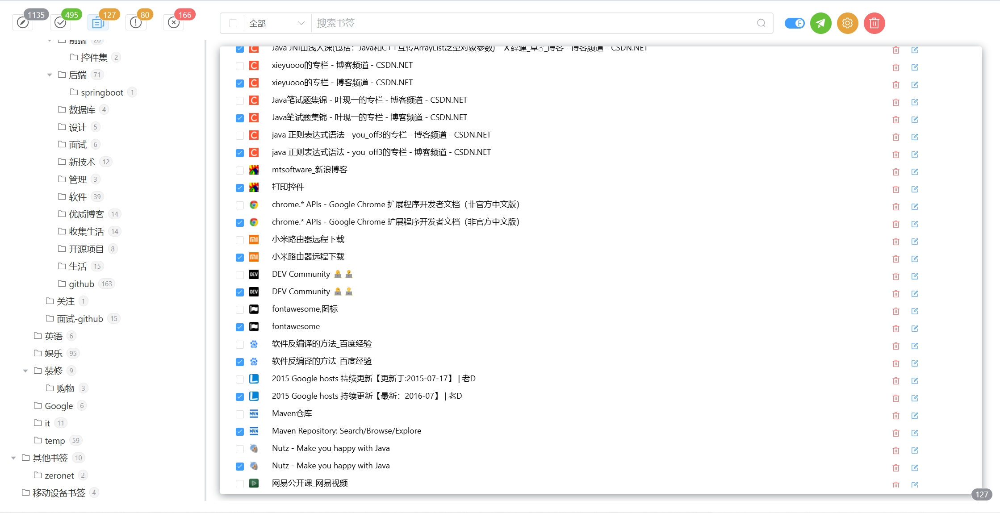
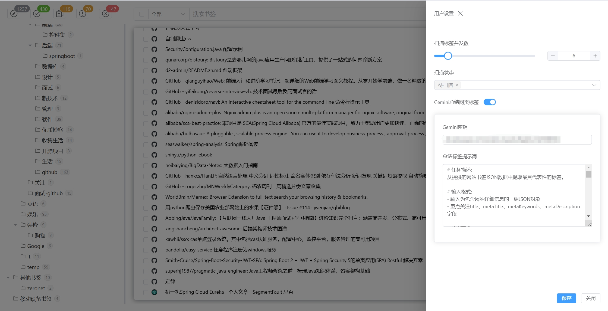

# MarkPlus-M 文档

Smart Bookmark Manager - Making Chrome Bookmark Management Easier

English | [简体中文](../README.md)

## ✨ Features

- 🤖 **AI-Powered** - Integrated with Google AI Studio for automatic tag generation
- 📊 **Data Analytics** - Visualize bookmark usage patterns
- 🔍 **Smart Search** - Multi-dimensional quick search
- 💾 **Local Storage** - Secure data with complete offline support
- 🛡️ **Privacy First** - No personal information collection

## 📦 Installation

1. Install from [Chrome Web Store](https://chromewebstore.google.com/detail/markplus-m/ggnkeikgmibbjjjfglhbnpjbacnbpgek) 安装

## 🚀 Quick Start
> Note: Bookmark management operations will sync with Chrome bookmarks. It's recommended to backup before making changes.

### Basic Usage
1. **Extension Search**
    - Use the dropdown menu on the left of the search box
    - Search through extension information
   

2. **Edit Mode**
    - In edit mode, webpage extension data is retrieved via chrome.tabs
    - Click again to stop retrieval

   > ⚠️ The retrieval process temporarily opens tabs. Concurrency can be adjusted in settings.

3. **Batch Management**
    - In edit mode, click the statistics in the top left
    - Batch delete bookmarks

### Configuration

> 💡 Webpage tag summarization requires a Google AI Studio key. Uses model: learnlm-1.5-pro-experimental

## 📝 Changelog

### 0.0.3
#### ✨ New Features
- Added automatic browser language detection
- Added bookmark data import/export functionality
- Added folder context menu
  - Support batch deletion
  - Support quick editing

#### 🐛 Bug Fixes
- Fixed page button failure caused by background service suspension

#### 🔨 Improvements
- Enhanced folder management experience
- Optimized data synchronization mechanism
